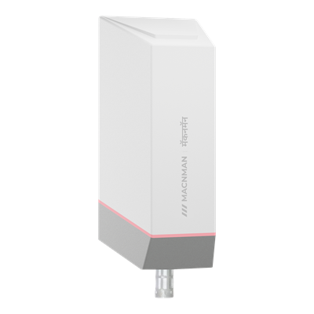

# Temperature & Humidity Sensor - MS_LBS_TH_X1



For more detailed information, please visit [Macnman Official Website](https://macnman.com/docs/category/lorawan)

## Codec

|      PLATFORM      | FILE                                                                   | FUNCTIONS                     |
| :----------------: | ---------------------------------------------------------------------- | ----------------------------- |
| The Things Network | [MacSync-LBS-TH-X1_TTN.js](Decoder/MacSync-LBS-TH-X1_TTN.js)           | decodeUplink / encodeDownlink |
|   ChirpStack v4    | [MacSync-LBS-TH-X1_Chirpstack.js](Decoder/MacSync-LBS-TH-X1_Chirpstack.js) | decodeUplink / encodeDownlink |
| Milesight Gateway  | [MacSync-LBS-TH-X1_Milesight.js](Decoder/MacSync-LBS-TH-X1_Milesight.js)   | Decode / Encode               |
|   Downlink only    | [MacSync-LBS-TH-X1_Encoder.js](Encoder/MacSync-LBS-TH-X1_Encoder.js)   | encodeDownlink                |

Each platform file holds both the uplink decoder and the downlink encoder.

## Payload

```
+-------------------------------------------------------------+
|              DEVICE UPLINK / DOWNLINK PAYLOAD               |
+-------------+-----------------------------------------------+
|    FPORT    |                    PAYLOAD                    |
+-------------+-------------------------+---------+-----------+
| frame type  |          DATA           | BATTERY |    UTC    |
|             |         N Bytes         | 1 Byte  |  4 Bytes  |
+-------------+-------------------------+---------+-----------+
```

The FPort tells the frame type. All multi-byte values are big-endian (MSB first). Most uplinks end with the battery level and the UTC time; downlinks carry the DATA only.

### Attribute

|   CHANNEL   |    FPORT    | LENGTH | DESCRIPTION                                                                                                                                                                                                         |
| :---------: | :---------: | :----: | ------------------------------------------------------------------------------------------------------------------------------------------------------------------------------------------------------------------- |
| Device Info |    0x05     |   10   | firmware_version(3B) + hardware_version(3B) + utc(4B)<br/>firmware_version, e.g. 010000 -> v1.0.0<br/>hardware_version, e.g. 020000 -> v2.0.0<br/>sent once after every join; the time in this frame may not be synced yet |
| Config ACK  | 0x10 - 0x15 | 2 - 10 | setting(N bytes) + battery(1B)<br/>sent on the same FPort as the downlink, with the setting now stored (same bytes as the [Downlink](#downlink) command)                                                              |

### Telemetry

|  CHANNEL  | FPORT |     LENGTH      | DESCRIPTION                                                                                                                                                                                                                                       |
| :-------: | :---: | :-------------: | ------------------------------------------------------------------------------------------------------------------------------------------------------------------------------------------------------------------------------------------------- |
| Heartbeat | 0x02  |       10        | error(1B) + temperature(2B) + humidity(2B) + battery(1B) + utc(4B)<br/>error, values: (0: ok, 1: sensor read failed)<br/>temperature, unit: °C, int16 / 100<br/>humidity, unit: %RH, int16 / 100<br/>battery, unit: %<br/>utc, unit: s (Unix time, UTC) |
| Sampling  | 0x03  | 7 + 2n / 7 + 4n | count(1B) + param(1B) + sample(2B or 4B) × n + battery(1B) + utc(4B)<br/>count, range: 2 - 12<br/>param, values: (0: temperature, 1: humidity, 2: both)<br/>sample: temperature(2B) and / or humidity(2B), int16 / 100, oldest first                  |
|  Trigger  | 0x04  |       14        | trig(1B) + param(1B) + event(1B) + value(2B) + min(2B) + max(2B) + battery(1B) + utc(4B)<br/>trig, values: (1, 2)<br/>param, values: (0: temperature, 1: humidity)<br/>event, values: (0: CLEAR, 1: ALARM)<br/>value, min, max: int16 / 100          |

## Downlink

Put the FPort in the JSON as `"port"` and send the downlink on the same FPort.

|      CHANNEL       |   FPORT   | LENGTH | DESCRIPTION                                                                                                                                                                                                                 |
| :----------------: | :-------: | :----: | --------------------------------------------------------------------------------------------------------------------------------------------------------------------------------------------------------------------------- |
| Reporting Interval | 0x10 (16) |   4    | interval(4B)<br/>interval, unit: s, range: 60 - 86399                                                                                                                                                                        |
|        ADR         | 0x11 (17) |   1    | adr(1B)<br/>adr, values: (0: off, 1: on)<br/>the device restarts to apply                                                                                                                                                   |
|    Message Type    | 0x12 (18) |   1    | msgtype(1B)<br/>msgtype, values: (0: unconfirmed, 1: confirmed)                                                                                                                                                             |
|    Message Info    | 0x13 (19) |   3    | adr(1B) + sf(1B) + msgtype(1B)<br/>sf, range: 7 - 12, used when ADR is off (DR = 12 - SF)<br/>the device restarts to apply                                                                                                   |
|      Trigger       | 0x14 (20) |   9    | trig(1B) + param(1B) + min(2B) + max(2B) + checktime(2B) + enable(1B)<br/>trig, values: (1, 2)<br/>param, values: (0: temperature, 1: humidity)<br/>min, max: int16, value × 100<br/>checktime, unit: s, range: 5 - 65535<br/>enable, values: (0: off, 1: on) |
|      Sampling      | 0x15 (21) |   3    | param(1B) + count(1B) + enable(1B)<br/>param, values: (0: temperature, 1: humidity, 2: both)<br/>count, range: 2 - 12<br/>enable, values: (0: off, 1: on)                                                                       |

## Example

### Uplink

```json
// FPort 2: 00 0A00 1789 62 6ABCDDA0
{
    "type": "heartbeat",
    "deviceInfo": {
        "fPort": 2,
        "battery": 98,
        "unixUTC": 1790762400,
        "timeUTC": "2026-09-30T10:00:00Z",
        "timeIST": "2026-09-30T15:30:00+05:30"
    },
    "sensorInfo": { "temperature": 25.6, "humidity": 60.25 }
}

// FPort 3: 06 02 07DC16EE 07EF1718 08011743 0814176E 08271799 083917C4 61 6ABCDDA0
{
    "type": "sampling",
    "deviceInfo": {
        "fPort": 3,
        "battery": 97,
        "unixUTC": 1790762400,
        "timeUTC": "2026-09-30T10:00:00Z",
        "timeIST": "2026-09-30T15:30:00+05:30"
    },
    "sensorInfo": {
        "param": "both",
        "count": 6,
        "samples": [
            { "temperature": 20.12, "humidity": 58.7 },
            { "temperature": 20.31, "humidity": 59.12 },
            { "temperature": 20.49, "humidity": 59.55 },
            { "temperature": 20.68, "humidity": 59.98 },
            { "temperature": 20.87, "humidity": 60.41 },
            { "temperature": 21.05, "humidity": 60.84 }
        ]
    }
}

// FPort 4: 01 00 01 109A 03E8 0FA0 5A 6ABCDDA0
{
    "type": "trigger",
    "deviceInfo": {
        "fPort": 4,
        "battery": 90,
        "unixUTC": 1790762400,
        "timeUTC": "2026-09-30T10:00:00Z",
        "timeIST": "2026-09-30T15:30:00+05:30",
        "trigNum": 1,
        "event": "ALARM"
    },
    "sensorInfo": { "param": "temperature", "value": 42.5, "min": 10, "max": 40 }
}

// FPort 5: 010000 020000 0000000C   (clock not synced yet: 12 s after start-up)
{
    "type": "boot",
    "deviceInfo": {
        "fPort": 5,
        "unixUTC": 12,
        "timeUTC": "1970-01-01T00:00:12Z",
        "timeIST": "1970-01-01T05:30:12+05:30",
        "Firmware Version": "1.0.0",
        "Hardware Version": "2.0.0"
    }
}

// FPort 16: 00000258 62
{
    "type": "config_ack",
    "configAck": {
        "appliedPort": 16,
        "feature": "tx_interval",
        "interval": 600,
        "battery": 98
    }
}

// FPort 21: 02 06 01 62
{
    "type": "config_ack",
    "configAck": {
        "appliedPort": 21,
        "feature": "sampling",
        "param": "both",
        "count": 6,
        "enable": "ENABLED",
        "battery": 98
    }
}
```

### Downlink

```json
// FPort 16: 00000258
{ "port": 16, "interval": 600 }

// FPort 17: 01
{ "port": 17, "adr": 1 }

// FPort 18: 01
{ "port": 18, "msgtype": 1 }

// FPort 19: 000901
{ "port": 19, "adr": 0, "sf": 9, "msgtype": 1 }

// FPort 20: 010003E80FA0003C01
{ "port": 20, "trig": 1, "param": 0, "min": 10.00, "max": 40.00, "checktime": 60, "enable": 1 }

// FPort 21: 020601
{ "port": 21, "param": 2, "count": 6, "enable": 1 }
```
