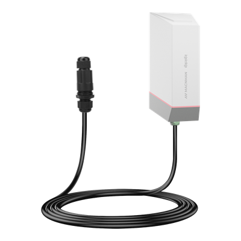

# RS485 & Analog to LoRaWAN Sensor - MS_LBS_STD_X1



For more detailed information, please visit [Macnman Official Website](https://macnman.com/docs/product/lorawan/dataloggers/rs485-analog-to-lorawan-converter-macsync-lx1)

## Codec

|      PLATFORM      | FILE                                                                                   | FUNCTIONS                                     |
| :----------------: | -------------------------------------------------------------------------------------- | --------------------------------------------- |
| The Things Network | [MacSync_LBS_STD_X1_RS485_TTN.js](Decoder/MacSync_LBS_STD_X1_RS485_TTN.js)               | decodeUplink / encodeDownlink                 |
|   ChirpStack v4    | [MacSync_LBS_STD_X1_RS485_Chirpstack.js](Decoder/MacSync_LBS_STD_X1_RS485_Chirpstack.js) | decodeUplink / encodeDownlink (v3: Decode)    |
| Milesight Gateway  | [MacSync_LBS_STD_X1_RS485_Milesight.js](Decoder/MacSync_LBS_STD_X1_RS485_Milesight.js)   | Decode / Encode                               |
|   Downlink only    | [MacSync_LBS_STD_X1_RS485_Encoder.js](Encoder/MacSync_LBS_STD_X1_RS485_Encoder.js)       | encodeDownlink                                |

Each platform file holds both the uplink decoder and the downlink encoder.

## Payload

```
+-------------------------------------------------------------+
|              DEVICE UPLINK / DOWNLINK PAYLOAD               |
+-------------+-----------------------------------------------+
|    FPORT    |                    PAYLOAD                    |
+-------------+-------------------------+---------+-----------+
| frame type  |          DATA           | BATTERY |    UTC    |
|             |         N Bytes         | 1 Byte  |  4 Bytes  |
+-------------+-------------------------+---------+-----------+
```

The FPort tells the frame type. All multi-byte values are big-endian (MSB first); only the [LSB] data types swap the two 16-bit words. Most uplinks end with the battery level and the UTC time; downlinks carry the DATA only.

### Attribute

|   CHANNEL   |    FPORT    | LENGTH | DESCRIPTION                                                                                                                                                                                                         |
| :---------: | :---------: | :----: | ------------------------------------------------------------------------------------------------------------------------------------------------------------------------------------------------------------------- |
| Device Info |    0x05     |   10   | firmware_version(3B) + hardware_version(3B) + utc(4B)<br/>firmware_version, e.g. 010000 -> v1.0.0<br/>hardware_version, e.g. 020000 -> v2.0.0<br/>sent once after every join; the time in this frame may not be synced yet |
| Config ACK  | 0x10 - 0x15 | 2 - 11 | setting(N bytes) + battery(1B)<br/>sent on the same FPort as the downlink, with the setting now stored (same bytes as the [Downlink](#downlink) command)<br/>FPort 20 adds source(1B) before the battery<br/>FPort 21 adds source(1B) + interval(2B) before the battery<br/>source, values: (0: RS485, 1: analog) |

### Telemetry

|     CHANNEL      | FPORT |      LENGTH      | DESCRIPTION                                                                                                                                                                                                                                                                                                                                 |
| :--------------: | :---: | :--------------: | ------------------------------------------------------------------------------------------------------------------------------------------------------------------------------------------------------------------------------------------------------------------------------------------------------------------------------------------- |
| RS485 Heartbeat  | 0x02  |    27 + data     | type(1B) + source(1B) + field(1B tag + values) × 20 + battery(1B) + utc(4B)<br/>type = 0x01, source = 0x00 (RS485)<br/>field 1 to field 20 in order, see [RS485 FIELD TAG](#rs485-field-tag)<br/>battery, unit: %<br/>utc, unit: s (Unix time, UTC)                                                                                       |
| Analog Heartbeat | 0x02  |      9 - 13      | type(1B) + source(1B) + channel_a(3B or 1B) + channel_b(3B or 1B) + battery(1B) + utc(4B)<br/>type = 0x01, source = 0x01 (analog)<br/>channel: mode(1B) + value(2B), or one 0x00 byte when the input is off<br/>mode, values: (1: 4-20 mA, 2: 0-10 V, 3: digital)<br/>value, uint16 / 1000, unit: mA or V (digital: 0 or 1000)                |
|     Sampling     | 0x03  | 9 + 4n / 10 + 8n | count(1B) + source(1B) + input(1B) + type(1B or 2B) + samples(float32) + battery(1B) + utc(4B)<br/>count, range: 2 - 12<br/>source, values: (0: RS485, 1: analog)<br/>input, values: (0: both, 1: field 1 / channel A, 2: field 2 / channel B)<br/>type: data type (RS485) or mode (analog); 2 bytes when input = 0<br/>samples: n × float32, oldest first; with both inputs n of input 1, then n of input 2 |
|     Trigger      | 0x04  |        15        | trig(1B) + param(1B) + event(1B) + value(2B) + min(2B) + max(2B) + battery(1B) + utc(4B) + source(1B)<br/>trig, values: (1, 2)<br/>param, values: (0: field 1 / channel A, 1: field 2 / channel B)<br/>event, values: (0: CLEAR, 1: ALARM)<br/>value, min, max: int16 / 100<br/>source, values: (0: RS485, 1: analog)                            |

### RS485 FIELD TAG

| BITS | 7...5                                                                                                                                                                         | 4...0                                                                                                                       |
| :--: | ----------------------------------------------------------------------------------------------------------------------------------------------------------------------------- | --------------------------------------------------------------------------------------------------------------------------- |
|      | data_type<br/>0x00: INT16<br/>0x01: UINT16<br/>0x02: INT32[MSB]<br/>0x03: INT32[LSB]<br/>0x04: FLOAT32[MSB]<br/>0x05: FLOAT32[LSB]<br/>0x06: UINT32[LSB]<br/>0x07: UINT32[MSB] | count<br/>number of values that follow, 1 - 5<br/>0xC0 (type 6, count 0): field off<br/>0xE0 (type 7, count 0): read failed |

INT16 and UINT16 values take 2 bytes each, the 32-bit types 4 bytes each. [MSB] = high word first, [LSB] = low word first. For coils and discrete inputs (function code 01 / 02) the count is the number of coil bytes, and each byte is sent as 2 bytes (0x00 + byte), first coil in bit 0.

### Modbus Reply

Sent straight after a Modbus downlink, on the same FPort. Every reply starts with header(4B) = 0x02 + 0x02 + fport(1B) + state(1B) and ends with utc(4B).

state, values: (0: ok, 1: failed, 2: invalid field number)

|      CHANNEL       |      FPORT       |  LENGTH  | DESCRIPTION                                                                                                                                         |
| :----------------: | :--------------: | :------: | --------------------------------------------------------------------------------------------------------------------------------------------------- |
| Field Config Reply | 0x0A (10), 0x0F (15) |    16    | header(4B) + index(1B) + slaveId(1B) + fc(1B) + enable(1B) + dataType(1B) + numParams(1B) + address(2B) + utc(4B)                               |
| Register Read Reply |    0x0D (13)     | 9 + data | header(4B) + tag(1B) + values + utc(4B)<br/>tag and values as in the RS485 heartbeat; state is always 0, a failed read gives tag 0xE0 and no values |
|    Write Reply     |  0x08 (8), 0x09 (9)  |    14    | header(4B) + slaveId(1B) + numReg(1B) + address(2B) + value(2B) + utc(4B)<br/>value: the low 16 bits of the value written                       |
|  Baud Rate Reply   |    0x0C (12)     |    11    | header(4B) + baud(2B) + parity(1B) + utc(4B)                                                                                                        |

## Downlink

Put the FPort in the JSON as `"port"` and send the downlink on the same FPort.

### Setting

|      CHANNEL       |   FPORT   | LENGTH | DESCRIPTION                                                                                                                                                                                                                                                  |
| :----------------: | :-------: | :----: | ------------------------------------------------------------------------------------------------------------------------------------------------------------------------------------------------------------------------------------------------------------ |
| Reporting Interval | 0x10 (16) |   4    | interval(4B)<br/>interval, unit: s, range: 60 - 86399                                                                                                                                                                                                         |
|        ADR         | 0x11 (17) |   1    | adr(1B)<br/>adr, values: (0: off, 1: on)<br/>the device restarts to apply                                                                                                                                                                                    |
|    Message Type    | 0x12 (18) |   1    | msgtype(1B)<br/>msgtype, values: (0: unconfirmed, 1: confirmed)                                                                                                                                                                                              |
|    Message Info    | 0x13 (19) |   3    | adr(1B) + sf(1B) + msgtype(1B)<br/>sf, range: 7 - 12, used when ADR is off (DR = 12 - SF)<br/>the device restarts to apply                                                                                                                                    |
|      Trigger       | 0x14 (20) |   9    | trig(1B) + param(1B) + min(2B) + max(2B) + checktime(2B) + enable(1B)<br/>trig, values: (1, 2)<br/>param, values: (0: field 1 / channel A, 1: field 2 / channel B)<br/>min, max: int16, value × 100<br/>checktime, unit: s, range: 30 - 65535<br/>enable, values: (0: off, 1: on) |
|      Sampling      | 0x15 (21) | 3 / 5  | param(1B) + count(1B) + enable(1B) + interval(2B, optional)<br/>param, values: (0: field 1 / channel A, 1: field 2 / channel B, 2: both)<br/>count, range: 2 - 12<br/>enable, values: (0: off, 1: on)<br/>interval, unit: s, range: 30 - 3600                    |

### Modbus

|    CHANNEL     |   FPORT   | LENGTH | DESCRIPTION                                                                                                                                                                                                                                      |
| :------------: | :-------: | :----: | ------------------------------------------------------------------------------------------------------------------------------------------------------------------------------------------------------------------------------------------------ |
|  Field Config  | 0x0A (10) |   8    | index(1B) + slaveId(1B) + fc(1B) + enable(1B) + dataType(1B) + numParams(1B) + address(2B)<br/>index, range: 1 - 20<br/>fc, values: (1, 2, 3, 4)<br/>dataType, see [RS485 FIELD TAG](#rs485-field-tag)<br/>numParams, range: 1 - 5<br/>address, counts from 1 |
| Field Read Back | 0x0F (15) |   1    | index(1B)<br/>index, range: 1 - 20                                                                                                                                                                                                               |
| Register Read  | 0x0D (13) |   6    | slaveId(1B) + fc(1B) + dataType(1B) + numParams(1B) + address(2B)                                                                                                                                                                                 |
| Register Write | 0x09 (9)  | 6 / 8  | slaveId(1B) + numReg(1B) + address(2B) + value(2B or 4B)<br/>numReg = 1: value 2 bytes (function code 06)<br/>numReg = 2: value 4 bytes, high word first (function code 16)                                                                      |
|   Coil Write   | 0x08 (8)  | 6 / 8  | slaveId(1B) + numReg(1B) + address(2B) + value(2B or 4B)<br/>numReg = 1: value 2 bytes, any non-zero value is ON (function code 05)<br/>numReg > 1: value 4 bytes, bit mask, first coil in bit 0 (function code 15)                              |
|   Baud Rate    | 0x0C (12) |   3    | baud(2B) + parity(1B)<br/>baud, range: 1200 - 57600 (115200 can be set only in the app)<br/>parity, values: (0: none, 1: even, 2: odd)                                                                                                            |

FPorts 13, 9 and 8 talk to the slave at once and do not switch on the sensor power output: use them only with slaves that have their own supply.

## Example

### Uplink

```json
// FPort 2 (RS485): 01 00 81 43666666 02 FF83 028A C1 E240 0001 E0 C0 C0 C0 C0 C0 C0 C0 C0 C0 C0 C0 C0 C0 C0 C0 C0 62 6ABCDDA0
{
    "type": "heartbeat",
    "deviceInfo": {
        "fPort": 2,
        "source": "rs485",
        "battery": 98,
        "unixUTC": 1790762400,
        "timeUTC": "2026-09-30T10:00:00Z",
        "timeIST": "2026-09-30T15:30:00+05:30"
    },
    "sensorInfo": {
        "fields": [
            {
                "field": 1,
                "status": "ok",
                "data_type": "float32",
                "values": [230.39999389648438]
            },
            {
                "field": 2,
                "status": "ok",
                "data_type": "int16",
                "values": [-125, 650]
            },
            {
                "field": 3,
                "status": "ok",
                "data_type": "uint32_swapped",
                "values": [123456]
            },
            { "field": 4, "status": "read_error" },
            { "field": 5, "status": "disabled" },
            { "field": 6, "status": "disabled" },
            { "field": 7, "status": "disabled" },
            { "field": 8, "status": "disabled" },
            { "field": 9, "status": "disabled" },
            { "field": 10, "status": "disabled" },
            { "field": 11, "status": "disabled" },
            { "field": 12, "status": "disabled" },
            { "field": 13, "status": "disabled" },
            { "field": 14, "status": "disabled" },
            { "field": 15, "status": "disabled" },
            { "field": 16, "status": "disabled" },
            { "field": 17, "status": "disabled" },
            { "field": 18, "status": "disabled" },
            { "field": 19, "status": "disabled" },
            { "field": 20, "status": "disabled" }
        ],
        "fields_ok": 3,
        "fields_off": 16,
        "fields_failed": 1
    }
}

// FPort 2 (analog): 01 01 01 303E 02 157C 62 6ABCDDA0
{
    "type": "heartbeat",
    "deviceInfo": {
        "fPort": 2,
        "source": "analog",
        "battery": 98,
        "unixUTC": 1790762400,
        "timeUTC": "2026-09-30T10:00:00Z",
        "timeIST": "2026-09-30T15:30:00+05:30"
    },
    "sensorInfo": {
        "channels": [
            {
                "channel": "A",
                "sensor_type": "4-20mA",
                "status": "ok",
                "current_mA": "12.35"
            },
            {
                "channel": "B",
                "sensor_type": "0-10V",
                "status": "ok",
                "voltage_V": "5.50"
            }
        ]
    }
}

// FPort 3: 03 00 01 04 43666666 43670000 4365CCCD 62 6ABCDDA0
{
    "type": "sampling",
    "deviceInfo": {
        "fPort": 3,
        "source": "rs485",
        "battery": 98,
        "unixUTC": 1790762400,
        "timeUTC": "2026-09-30T10:00:00Z",
        "timeIST": "2026-09-30T15:30:00+05:30"
    },
    "sensorInfo": {
        "sample_count": 3,
        "field": 1,
        "data_type": "float32",
        "samples": ["230.40", "231.00", "229.80"]
    }
}

// FPort 4: 01 00 01 0140 0190 07D0 5A 6ABCDDA0 01
{
    "type": "trigger",
    "deviceInfo": {
        "fPort": 4,
        "source": "analog",
        "battery": 90,
        "unixUTC": 1790762400,
        "timeUTC": "2026-09-30T10:00:00Z",
        "timeIST": "2026-09-30T15:30:00+05:30",
        "trigNum": 1,
        "event": "ALARM"
    },
    "sensorInfo": {
        "param": "Channel A",
        "value": "3.20",
        "min": "4.00",
        "max": "20.00"
    }
}

// FPort 5: 010000 020000 00000000   (clock not synced yet)
{
    "type": "boot",
    "deviceInfo": {
        "fPort": 5,
        "unixUTC": 0,
        "timeUTC": "not synced",
        "timeIST": "not synced",
        "Firmware Version": "1.0.0",
        "Hardware Version": "2.0.0"
    }
}

// FPort 20: 01 00 0190 07D0 003C 01 01 5A
{
    "type": "config_ack",
    "configAck": {
        "appliedPort": 20,
        "feature": "trigger",
        "trig": 1,
        "param": "Channel A",
        "source": "analog",
        "min": "4.00",
        "max": "20.00",
        "checktime": 60,
        "enable": "ENABLED",
        "battery": 90
    }
}

// FPort 21: 02 06 01 01 012C 62
{
    "type": "config_ack",
    "configAck": {
        "appliedPort": 21,
        "feature": "sampling",
        "param": "both",
        "source": "analog",
        "count": 6,
        "enable": "ENABLED",
        "interval": 300,
        "battery": 98
    }
}

// FPort 10: 02 02 0A 00 01 01 03 01 04 02 0BB9 6ABCDDA0
{
    "type": "modbus_ack",
    "deviceInfo": {
        "fPort": 10,
        "unixUTC": 1790762400,
        "timeUTC": "2026-09-30T10:00:00Z",
        "timeIST": "2026-09-30T15:30:00+05:30"
    },
    "modbusAck": {
        "state": 0,
        "state_text": "ok",
        "feature": "field_config_set",
        "index": 1,
        "slaveId": 1,
        "fc": 3,
        "enable": 1,
        "data_type": "float32",
        "numParams": 2,
        "address": 3001
    }
}

// FPort 13: 02 02 0D 00 22 01F4 0064 6ABCDDA0
{
    "type": "modbus_ack",
    "deviceInfo": {
        "fPort": 13,
        "unixUTC": 1790762400,
        "timeUTC": "2026-09-30T10:00:00Z",
        "timeIST": "2026-09-30T15:30:00+05:30"
    },
    "modbusAck": {
        "state": 0,
        "state_text": "ok",
        "feature": "register_read",
        "data_type": "uint16",
        "values": [500, 100]
    }
}

// FPort 13: 02 02 0D 00 E0 6ABCDDA0   (the slave did not answer)
{
    "type": "modbus_ack",
    "deviceInfo": {
        "fPort": 13,
        "unixUTC": 1790762400,
        "timeUTC": "2026-09-30T10:00:00Z",
        "timeIST": "2026-09-30T15:30:00+05:30"
    },
    "modbusAck": {
        "state": 0,
        "state_text": "ok",
        "feature": "register_read",
        "read": "error"
    }
}

// FPort 12: 02 02 0C 00 4B00 01 6ABCDDA0
{
    "type": "modbus_ack",
    "deviceInfo": {
        "fPort": 12,
        "unixUTC": 1790762400,
        "timeUTC": "2026-09-30T10:00:00Z",
        "timeIST": "2026-09-30T15:30:00+05:30"
    },
    "modbusAck": {
        "state": 0,
        "state_text": "ok",
        "feature": "baud",
        "baud": 19200,
        "parity": 1
    }
}
```

### Downlink

```json
// FPort 16: 00000708
{ "port": 16, "interval": 1800 }

// FPort 17: 01
{ "port": 17, "adr": 1 }

// FPort 18: 01
{ "port": 18, "msgtype": 1 }

// FPort 19: 000901
{ "port": 19, "adr": 0, "sf": 9, "msgtype": 1 }

// FPort 20: 0100019007D0003C01
{ "port": 20, "trig": 1, "param": 0, "min": 4.00, "max": 20.00, "checktime": 60, "enable": 1 }

// FPort 21: 020601012C
{ "port": 21, "param": 2, "count": 6, "enable": 1, "interval": 300 }

// FPort 10: 0101030104020BB9
{ "port": 10, "index": 1, "slaveId": 1, "fc": 3, "enable": 1, "dataType": 4, "numParams": 2, "address": 3001 }

// FPort 15: 01
{ "port": 15, "index": 1 }

// FPort 13: 010401020001
{ "port": 13, "slaveId": 1, "fc": 4, "dataType": 1, "numParams": 2, "address": 1 }

// FPort 9: 0101000104D2
{ "port": 9, "slaveId": 1, "numReg": 1, "address": 1, "value": 1234 }

// FPort 9: 0102000100011170
{ "port": 9, "slaveId": 1, "numReg": 2, "address": 1, "value": 70000 }

// FPort 8: 010100010001
{ "port": 8, "slaveId": 1, "numReg": 1, "address": 1, "value": 1 }

// FPort 12: 4B0001
{ "port": 12, "baud": 19200, "parity": 1 }
```
